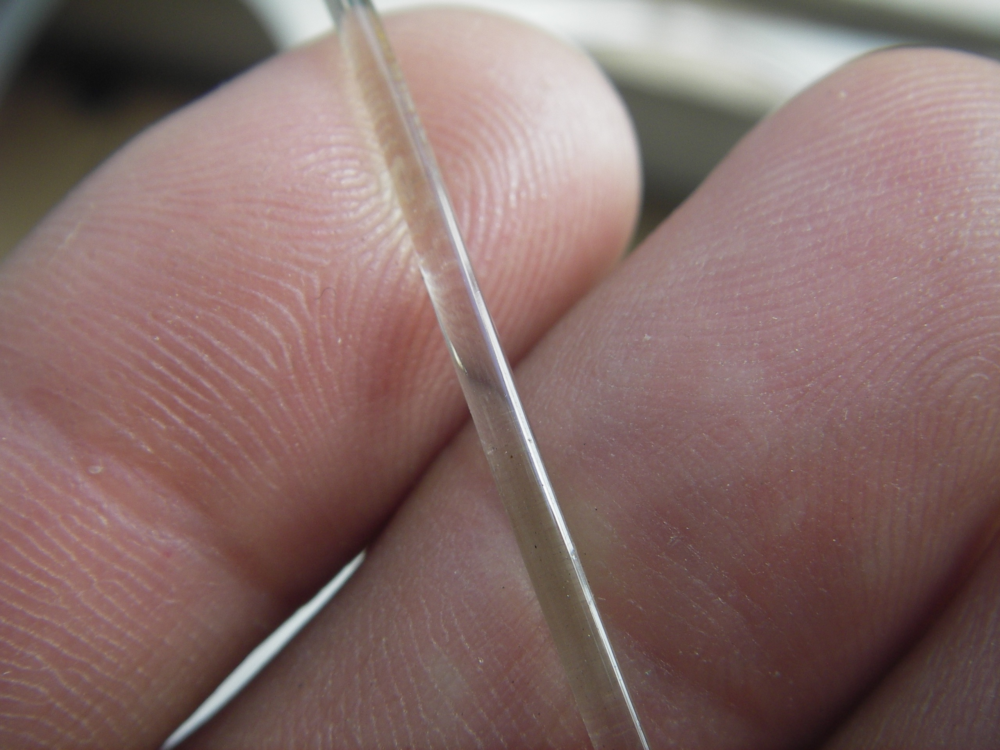

# Thunderhead Filament Extruder

The Thunderhead filament extruder is a  small scale extruder designed by Techfortrade for that can be used for recycling PET plastic bottles into 3D printing filament. A special emphasis throughout the design has been placed on using affordable and easily attainable materials. This repository serves as a
host for the documentation and code used with the machine. We are using GrabCAD Workbench for the hardware development and will place snapshots of the CAD files here on Github with each release. Current (though not necessarily stable) files can be accessed on our [GrabCAD partner space](https://workbench.grabcad.com/workbench/projects/gcvN9Xsi01SW-lFGhJRj_-4vqndCMFAaoUt_-UQBdidnVn#/space/gc8b8c582LagITdwrMEId6wysTlJX_nukUvWoRwEQ_1f4U).

# This is Thunderhead:

# Thunderhead turns this:

# Into this:

It does this by

1. Melting PET 2. Pushing it through a very small hole (4mm) 3. Pulling the
  filament that comes out through a water bath to cool the plastic down 4. Winding
  the plastic up on a spool for future use 5. Repeating

In order to make the documentation more paletable, from here on the machine will
be described in parts.

## Hardware

### Overview

## Extruder

The most important part of Thunderhead is the extruder. Driving by a !SPEC HERE!
stepper motor, Thunderhead pushes shredded PET through a heated barrel with an
auger which causes the plastic to melt. This melted plastic is then pushed out
of a hole with a diameter of 5mm.

### Stepper

A **NEMA42** stepper with a touque rating of 4100 ***oz***/***in*** is used.
Although this is hard to source locally, we rationalize our choice with the
following points:

1. More touque == More better. With a higher tourque, we can move at higher
  speeds without the fear of skipped steps. 2. It's easy to use, and very robust.
2. Variable frequence drives are commonly more expensive and their extra tourque
  is not needed.

(A **NEMA34** has been show to be a usuful alternative, and due to its relativly
very low cost, it is a hard constestant for the spotlight.)

Currently, our motor and stepper costs 390$ combined. We use the [KL-2283
stepper driver](LINK).

### Auger

The part that feeds plastic to the extruder is is a half inch diameter 18 inch
long ship auger deisgned for drilling holes in wood. Easy to obtain, low cost
(22$) and very robust, work very well when one considers that they are not
designed for plastic extrusion. While a properly deisgned screw (a plastic
extrusion screw) would work better, we have found these augers to be quite
practical.

### Heat

#### Heating Zones

The barrel of the extruder has a total of 5 heating zones, two on the barrel,
two on the cooling tube and one on the nozzle. Each heating zone has its own
temperature sensor and control circuitry allowing the temperatures to be set
independently of each other. The first two heating zones on the barrel are
typically set near 265°C.  High temperature fiberglass insulation is used to
reduce heat loss.

At the end of the barrel, the plastic makes a 90° turn and heads straight down
inside of the cooling tube. This tube with its two heating zones is held at a
temperature of around 195 °C. The idea is to cool the plastic as much as
possible before it leaves the nozzle. The nozzle has the final heating zone, and
can be set to a higher temperature to help improve the surface finish of the
plastic and possibly improve the flow of plastic near the inside walls of the
nozzle. This granular control help obtain plug flow (as opposed to laminar
flow.)

Laminar Flow:  

Plug Flow: 

This is done by decreasing the outside viscocity (through heat) and increasing
the inside viscocity by cooling it (via the cooling stages).

#### Heaters

The first two zones are 1/2" by two feet long tape heater. The 104W tape heaters
are fibreglass insulated nichrome wire which can be run on 110 or 220 VAC. They
are purchased from briskheat and are sutible for use on an electrical conductive
surface. They are rated up to 700°C which is much higher than our current need,
allowing us to make design changes without worrying about heat. In the future it
maybe worthwile to change to a bandheater for cost reasons.

#### Thermistors

100kΩ thermistors  are used. SPEC HERE. They are commonly used in 3D printing.
We plan to switch to thermocouples but we initially chose thermistors because of
the already existing knowledgebase sorrounding thermistors in people who 3D
print.

### Breaker Plate & Fume Control

 

Between the end of the barrel and the cooling tube is the breaker plate, which
helps to straighten the flow of the polymer. The rotation of the screw creates a
twist in the polymer, which it would “remember” were there no breaker plate.
This twist causes wavy corkscrew shaped filament.

Finally, the extruder has a sheet metal cover, which captures fumes and channels
them into an exhaust duct.

### End

While the recommended diameter of the final output is 1/2 half of the diameter
of the preceding pipe (giving us a diameter of 3mm), we have had problems with
an unsufficant neck-down distance. (This is the distane that the plastic
naturally decreases in diameter due to tension.) As such, we have an final
extrusion diameter of 4mm.

## Starve Feeder

The extruder is fed by a starve feeder. Using a vibratory conveyor, PET is fed
to the extruder at a precise rate. This is done with spring steel (sections of
cut tape measure) and a motor with an of center weight.

## Water Bath

PET plastic crystalizes if it cools too slowly. Crystallization causes the
plastic to become more brittle and opaque which are not desired qualities in PET
3D printer filament. To avoid crystallization, the plastic is extruded straight
into a water bath where the temperature of the plastic is reduced fast enough to
avoid crystallization.

### Guides

There are 7 guide wheels in the water bath that hold the filament in a straight
line as it passes through the water bath. The first is a large aluminum disk
with a grooved edge. It spins with a tangential velocity matching the velocity
of the filament, which helps to avoid skipping that is observed when the wheel
is stationary. The other guides are v-grooved rollers (though they don’t spin).
They guide the filament while allowing bumps and bends to pass without hanging
up.

## Out Feed

The outfeed is used to pull the filament through the water bath and control its
diameter (see Figure 4 for image). It consists of a diameter sensor and a set of
rollers driven by a stepper motor. The diameter sensor will be located just
below the nozzle and the outfeed rollers are located at the end of the water
bath.

Ideally, if the extruder were to extrude at a constant rate, the outfeed could
be set at a corresponding constant rate to achieve the desired filament diameter
by drawing down the hot plastic. The diameter sensor could be placed near the
outfeed rollers and used to make sure the rollers are running at the correct
speed. Due to the non-uniform nature of the bottle flake and the lack of a screw
designed for plastic extrusion (among other possible issues), the rate at which
plastic leaves the extruder varies and thus the required outfeed roller speed
required to obtain the desired diameter also varies.

The diameter sensor will be used to determine if the outfeed roller speed needs
to be adjusted to keep the filament within the desired tolerance. To be
effective, it needs to be located where the plastic is being drawn down. This is
just under the nozzle where the plastic is molten. The diameter sensor thus must
be able to make measurements without contacting the filament and must be
waterproof. It is currently under development [here](LINKHERE) and utilizes a
laser and Charge Coupled Device (CCD) array.

## Spooler

The spooler winds the filament onto a spool after it leaves the outfeed. It is
equipped with a sensor that measures the tension on the filament. A proportional
integral derivative (PID) controller adjusts the speed of the spooler to
maintain a constant tension.

## Controller

The controller holds all of the electronics necessary to run the machine and the
user interface. The machine can be powered with either 120 or 220 VAC. Only the
heaters for the extruder are voltage specific. The machine is fused and
protected by a Ground Fault Circuit interrupter (GFCI) device to prevent
unfortunate situations.

## On Going Work

All the present files can be found [here on our GrabCAD
Workbench](https://workbench.grabcad.com/workbench/projects/gcvN9Xsi01SW-lFGhJRj_-4vqndCMFAaoUt_-UQBdidnVn#/space/gc8b8c582LagITdwrMEId6wysTlJX_nukUvWoRwEQ_1f4U).

## Planned Improvements

### Drying hopper

Currently the plastic is dried and then put into the hopper where it sits and
absorbs moisture. With a drying hopper, the plastic would be continuously dried
and would have no chance to absorb moisture before entering the machine. This
may help improve the melt viscosity by reducing the amount of polymer
hydrolysis.

### Non Contact Diameter Sensor

In order to effectively control the diameter by varying the speed of the outfeed
rollers, the diameter must be measured at or close to the point where changes in
roller speed have the greatest effect on the diameter. This is in a location
where the plastic cannot be touched, just below the nozzle and above the surface
of the water. Using a laser and a CCD array, the diameter could be measured by
taking a picture of the shadow of the plastic melt as it enters the water bath.
The gap between the water bath and the nozzle is only about 10 mm so the sensor
will be partially submerged in water. It will need to be waterproof.

### New Filament support/guiding strategy

The shape and diameter of the filament is essentially set when the hot plastic
enters the water bath. Unwanted movement of the filament down stream from this
point can greatly impact the shape of the filament. New strategies for guiding
the filament in a controlled manner need to be explored. The shape of the
filament is also heavily impacted by the large guide wheel which it contacts
just after it enters the water. Are there other ways to support the filament as
it moves through the water bath that result in more consistent shape?

### Nozzle Geometry and Drawdown

It may be fruitful to explore different nozzle geometries and the amount and
rate of drawdown. What are the optimal conditions for consistent filament?

### Test different sources of PET

Not all PET resins are the same. By testing resins from various bottle sources
and even virgin pellets, it may be possible to determine whether or not some
sources have more desirable characteristics than others.

### Melt Filter

A screen should be added just up stream of the breaker plate. This screen will
catch debris and improve the quality of the filament.

### Explore potential additives

Desiccating agents such as CaO (quicklime) or even Portland cement might
possibly be added to scavenge water remaining in the melt, which would help
improve viscosity. Nucleating agents such as sodium benzoate and talc might be
used to encourage crystal growth, growing more numerous and smaller crystals
which may help to reduce the brittleness of crystalline polymer.

## Software

The software that faccilitates the use of Thunderheadand its accompaning
documentation can be found [here](https://github.com/Maaphoo/Thunderware).

## Maintainers

[Matthew Rogge](https://github.com/Maaphoo) and [Michael
Uttmark](https://github.com/biosafetylvl5) are currently the maintainers of this
repository.

## Acknowledgements

The following people and organizations provided valuable help and guidance over
the course of the project:

**Matt Clark** who provided hundreds of free man hours to assist with the
**re-design process.

**Frank Schoofs** who volunteered his material science expertise to assist with
**calculations required to re-design extrusion temperature settings and speeds.

**Vasileios Grammatikakis** an electronics expert who has assisted with
**improvements to the Thunderhead electronics.

**Unilever plc.** whose PET specialists have provided assistance in designing
**plastic sampling approaches

## License

This work is licensed under the Creative Commons Attribution 4.0 International
License. To view a copy of this license, visit
http://creativecommons.org/licenses/by/4.0/.
