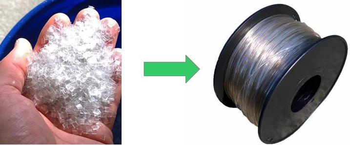

# Thunderhead Filament Extruder

The Thunderhead filament extruder is a  small scale extruder designed by Techfortrade that can be used for recycling PET plastic bottle flake directly into 3D printing filament. A special emphasis throughout the design has been placed on using affordable and easily attainable materials. This repository serves as a host for the documentation and code used with the machine. We are using GrabCAD Workbench for the hardware development and will place snapshots of the CAD files here on Github with each release. Current (though not necessarily stable) files can be accessed on our [GrabCAD partner space](https://workbench.grabcad.com/workbench/projects/gcvN9Xsi01SW-lFGhJRj_-4vqndCMFAaoUt_-UQBdidnVn#/space/gc8b8c582LagITdwrMEId6wysTlJX_nukUvWoRwEQ_1f4U).

#### The Thunderhead converts clean and dry PET flake into 3D printing Filament

## Table of Contents

- [Goals](#Goals)
- [PET Plastic](#PET Plastic)
- [Safety/Liability](#Safety/Liability)
- [Building the Thunderhead](#Building the Thunderhead)
- [Software](#Software)
- [Operation](#Operation)
- [Contributing](#Contributing)
- [Maintainers](#Maintainers)
- [Acknowledgements](#Acknowledgements)
- [License](#License)

## Goals
The Thunderhead is designed with the intent of making it possible to recycle plastic from the post consumer waste stream into 3D printing filament on a small scale with minimal start up capital required. This makes the following possible:
- Low cost 3D printing filament anywhere in the world
- Enable local capture of the value contained in waste plastic
- Access to expensive or hard to find items via 3D printing (eg. [Open Flexure Microscope](https://github.com/rwb27/openflexure_microscope))
- Small scale business opportunities without need for large amounts of capital
- Enable local recycling where it is otherwise not possible

## PET Plastic 
The Thunderhead is designed to extrude Polyethylene Terephthalate (PET or PETE) for the following reasons:

-  Prints  very well on printers such as the Retr3D
-  Easy to find nearly anywhere on the planet
-  Has good physical properties
-  Reasonably safe to work with, especially compared to ABS which often has Brominated Flame Retardants (BFR)

PET is easily identified by the following symbol usually located on the bottom on the bottle:

There are some challenges to working with PET plastic. A few these are described below. Follow the links to get more detailed information on these and other challenges:

* **Crystalization** - PET crystalizes when cooled slowly. To avoid making filament that is brittle like glass, a water bath is used.
* **Low Viscosity** - When PET melts it has a low viscosity and a low melt strength which makes it difficult to pull into a filament with an even diameter. The Thunderhead uses a cooling tube to help increase the viscosity and melt strength before the plastic leaves the extruder. The water bath also helps to 
* **Hygroscopicity** - PET pulls water out of the air and holds on to it. This water can cause problems during extrusion and printing such as air bubbles, foaming and degredation of the plastic.
* **Hydrolysis** - The polymer chains in PET can break down in the presence of water at elevated temperatures. When this happens, the viscosity of the melt is reduced, making it difficult to extrude. To Avoid this problem, the plastic flakes must be thoroughly dried just before extrusion. 

## Safety/Liability

You are responsible for your own safety.

## Building the Thunderhead

Please refer to our [wiki](https://github.com/TechforTrade/Thunderhead-Filament-Extruder/wiki) for detailed information on building the Thunderhead. 

#### Tools Required####

Note that you don't necessairily have to own all of these tools. A local shop could some of the work for you. Especially the lathe and milling work.

* Drill Press
* Metal Lathe
* Milling Machine
* Welding (stick, oxy-acetalene, etc.) - for welding frames together
* 3D printer

## Software

Please refer to our [wiki](https://github.com/TechforTrade/Thunderhead-Filament-Extruder/wiki) for detailed information on the use of the various bits of code kept in this repository.

Five firmware installations must be completed to get the Thunderhead up and running. These are:

- **Thunderware.ino** - for the Arduino mega 2560 that controls the machine (located in the controller box)
- **StarveFeeder.ino** - Upload to the Arduino Nano that controls the starve feeder.
- **Diameter_Sensor.ino (x2)** - Install on <u>both</u> the primary and QC diameter sensor Arduino Nanos.
- **Spooler.ino** - Upload to the Arduino Nano that controls the spooler.

Additionally, there is code written in Processing called **Extruder_Data_visualizer.pde** that produces real time graphs of the the output of the diameter sensors as well as the outfeed roller RPM. This can be useful for tuning the PID in the primary diameter sensor that controls the filament diameter.

## Operation

## Contributing

We'd love your help! You can contribute in many ways. Here are a few:

* Technical support on designs, code etc.
* Help improve the wiki and other documentation.
* Connect us with other interested individuals and groups.
* ​

## On Going Work

All the present files can be found [here on our GrabCAD Workbench](https://workbench.grabcad.com/workbench/projects/gcvN9Xsi01SW-lFGhJRj_-4vqndCMFAaoUt_-UQBdidnVn#/space/gc8b8c582LagITdwrMEId6wysTlJX_nukUvWoRwEQ_1f4U).

## Planned Improvements

### Drying hopper

Currently the plastic is dried and then put into the hopper where it sits and
absorbs moisture. With a drying hopper, the plastic would be continuously dried
and would have no chance to absorb moisture before entering the machine. This
may help improve the melt viscosity by reducing the amount of polymer
hydrolysis.

### Non Contact Diameter Sensor

In order to effectively control the diameter by varying the speed of the outfeed
rollers, the diameter must be measured at or close to the point where changes in
roller speed have the greatest effect on the diameter. This is in a location
where the plastic cannot be touched, just below the nozzle and above the surface
of the water. Using a laser and a CCD array, the diameter could be measured by
taking a picture of the shadow of the plastic melt as it enters the water bath.
The gap between the water bath and the nozzle is only about 10 mm so the sensor
will be partially submerged in water. It will need to be waterproof.

### New Filament support/guiding strategy

The shape and diameter of the filament is essentially set when the hot plastic
enters the water bath. Unwanted movement of the filament down stream from this
point can greatly impact the shape of the filament. New strategies for guiding
the filament in a controlled manner need to be explored. The shape of the
filament is also heavily impacted by the large guide wheel which it contacts
just after it enters the water. Are there other ways to support the filament as
it moves through the water bath that result in more consistent shape?

### Nozzle Geometry and Drawdown

It may be fruitful to explore different nozzle geometries and the amount and
rate of drawdown. What are the optimal conditions for consistent filament?

### Test different sources of PET

Not all PET resins are the same. By testing resins from various bottle sources
and even virgin pellets, it may be possible to determine whether or not some
sources have more desirable characteristics than others.

### Melt Filter

A screen should be added just up stream of the breaker plate. This screen will
catch debris and improve the quality of the filament.

### Explore potential additives

Desiccating agents such as CaO (quicklime) or even Portland cement might
possibly be added to scavenge water remaining in the melt, which would help
improve viscosity. Nucleating agents such as sodium benzoate and talc might be
used to encourage crystal growth, growing more numerous and smaller crystals
which may help to reduce the brittleness of crystalline polymer.

## Maintainers

[Matthew Rogge](https://github.com/Maaphoo) and [Michael Uttmark](https://github.com/biosafetylvl5) are currently the maintainers of this
repository.

## Acknowledgements

The following people and organizations provided valuable help and guidance over
the course of the project:

**Matt Clark** who provided hundreds of free man hours to assist with the
**re-design process.

**Frank Schoofs** who volunteered his material science expertise to assist with
**thermal modeling required to design heating and cooling sections of the extruder.

**Vasileios Grammatikakis** an electronics expert who has assisted with
**improvements to the Thunderhead electronics.

**Unilever plc.** whose PET specialists have provided insights into
**working with PET, drying, and testing.

## 

## License

This work is licensed under a <a rel="license" href="http://creativecommons.org/licenses/by-sa/4.0/">Creative Commons Attribution-ShareAlike 4.0 International License</a>.
