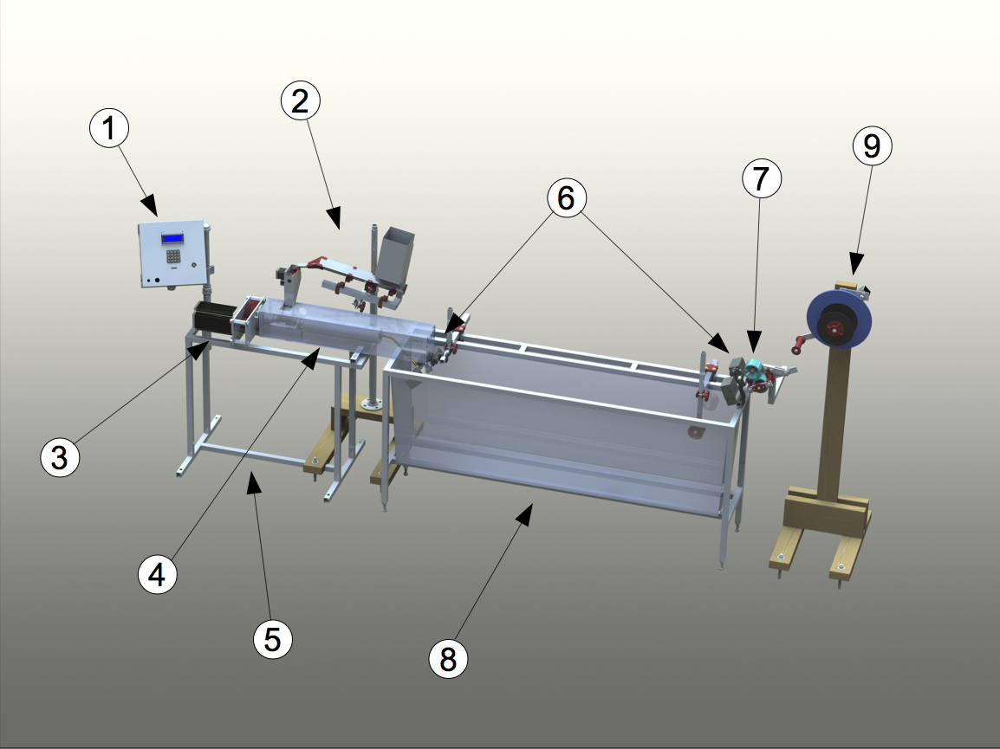

# Thunderhead Filament Extruder

The Thunderhead filament extruder is a  small scale extruder designed by Techfortrade that can be used for recycling PET plastic bottle flake directly into 3D printing filament. A special emphasis throughout the design has been placed on using affordable and easily attainable materials. This repository serves as a host for the documentation and code used with the machine. We are using GrabCAD Workbench for the hardware development and will place snapshots of the CAD files here on Github with each release. Current (though not necessarily stable) files can be accessed on our [GrabCAD partner space](https://workbench.grabcad.com/workbench/projects/gcvN9Xsi01SW-lFGhJRj_-4vqndCMFAaoUt_-UQBdidnVn#/space/gc8b8c582LagITdwrMEId6wysTlJX_nukUvWoRwEQ_1f4U).

#### The Thunderhead converts clean and dry PET flake into 3D printing Filament

# Table of Contents

- [Goals](#goals)
- [PET Plastic](#pet-plastic)
- [Safety and Liability](#safety-and-liability)
- [Building the Thunderhead](#building-the-thunderhead)
- [Software](#software)
- [Operation](#operation)
- [Contributing](#contributing)
- [Maintainers](#maintainers)
- [Acknowledgements](#acknowledgements)
- [License](#license)

## Goals
The Thunderhead is designed with the intent of making it possible to recycle plastic from the post consumer waste stream into 3D printing filament on a small scale with minimal start up capital required. This makes the following possible:
- Low cost 3D printing filament anywhere in the world
- Enable local capture of the value contained in waste plastic
- Access to expensive or hard to find items via 3D printing (eg. [Open Flexure Microscope](https://github.com/rwb27/openflexure_microscope))
- Small scale business opportunities without need for large amounts of capital
- Enable local recycling where it is otherwise not possible

## PET Plastic 
The Thunderhead is designed to extrude Polyethylene Terephthalate (PET or PETE) for the following reasons:

-  Prints  very well on printers such as the Retr3D
-  Easy to find nearly anywhere on the planet
-  Has good physical properties
-  Reasonably safe to work with, especially compared to ABS which often has Brominated Flame Retardants (BFR)

PET is easily identified by the following symbol usually located on the bottom on the bottle:

There are some challenges to working with PET plastic. A few these are described below. Follow the links to get more detailed information on these and other challenges:

* **Crystalization** - PET crystalizes when cooled slowly. To avoid making filament that is brittle like glass, a water bath is used.
* **Low Viscosity** - When PET melts it has a low viscosity and a low melt strength which makes it difficult to pull into a filament with an even diameter. The Thunderhead uses a cooling tube to help increase the viscosity and melt strength before the plastic leaves the extruder. The water bath also helps to 
* **Hygroscopicity** - PET pulls water out of the air and holds on to it. This water can cause problems during extrusion and printing such as air bubbles, foaming and degredation of the plastic.
* **Hydrolysis** - The polymer chains in PET can break down in the presence of water at elevated temperatures. When this happens, the viscosity of the melt is reduced, making it difficult to extrude. To Avoid this problem, the plastic flakes must be thoroughly dried just before extrusion. 

## Safety and Liability

You are responsible for your own safety. This machine is under development. Please see the text in the license regarding **Disclaimer of Warranties and Limitation of Liability**.

## Building the Thunderhead

Please refer to our [wiki](https://github.com/TechforTrade/Thunderhead-Filament-Extruder/wiki) for detailed information on building the Thunderhead. 

#### Major Tools Needed ####

Note that you don't necessarily have to own all of these tools. A local shop could do some of the work for you. Especially the lathe and milling work. See the Wiki for a more exhaustive list.

* Drill Press
* Metal Lathe - Threading the barrel and making the shaft for the gear box
* Welding (stick, oxy-acetalene, etc.) - For welding frames together
* 3D printer - Many of the complex parts in the machine are 3D printed
* Milling Machine (optional) - For milling flats into a few parts. Could be done with grinder and hand files though more time consuming.
* Horizontal band saw (optional) - For cutting stock metal to size. A hacksaw and vice will work, but will be slower.

#### Major Components of the Thunderhead - THIS NEEDS UPDATING

1. **Control Box** - Contains the power supply, Arduino, and other circuitry needed to operate the extruder. Note: The starve feeder, diameter sensors and spooler have their own control circuitry and communicate with the master Arduino via IIC.
2. **Starve Feeder**- Used to add flakes to the extruder at a constent rate. Subcomponents are:
   1. Hopper - Holdes flake ready to be extruded
   2. Vibratory Conveyer - Moves flake to the balance and keeps flake from bridging, and rat holing.
   3. Balance - Weighs out small portions of flake and then delivers them to the extruder at a constant rate. Feedback from the balance controls the vibratory conveyer.
3. **Auger Motor and Gear Box** - A large NEMA 42 stepper motor and 3:1 gear box with 3D printed gears. The stepper alows for speed control and the gearbox increases the torque on the auger.
4. **Extruder Body** - The extruder body has many components. The main components are:
   1. Feed Throat - Location where the plastic enters the barrel. Made with internal grooves to improve the feeding of the plastic into the barrel.
   2. Auger - A 1/2 in. diameter, 18 in. long wood auger used to convey the plastic through the barrel. NOTE: This is not designed for plastics extrusion and performs significantly worse than a plastic extrusion screw would. It is much less expensive though.
   3. Barrel - 1/2in I.D. DOM metal pipe through which the auger pushes the plastic. It has two heating zones that are heated by 104 watt 1/2 in. fiberglass insulated heating tape.
   4. Breaker plate - A small disk of metal with a number of holes drilled into it at the downstream end of the barrel. It acts to reduce the twist in the plastic that is caused by the screw, reducing what is called "screw beat" and improving the uniformity of the diameter. 
   5. Cooling tube - A brass tube at the end of the barrel that reduces the temperature of the plastic melt in order to increase its viscosity. The bend in the tube helps to aim the filament at the guide roller at the end of the water bath and improve roundness of the filament. It has two heating zones.
   6. Nozzle - determines diameter of melt as it leaves the extruder. Equiped with its own heating zone so that surface quality of the filament can be improved.
5. **Extruder Stand** - Supports the extruder and has a sheet metal enclosure to collect fumes given off by the extruder.
6. **Diameter Sensors** - Non contact laser diameter sensors with their own control electronics. The first is used to determine the diameter of the melt as it leaves the extruder and control the speed of the outfeed rollers in order to maintain a constant diameter. The second is used to monitor the final diameter and ensure that the set point of the first diameter sensor is correct.
7. **Outfeed Rollers** - Used to pull the filament through the water bath. Their speed determines the diameter of the filament. The rollers are controlled by the primary diameter sensor.
8. **Water Bath** - Used to cool the melt quickly. This is important because otherwise, the PET would neck down to a very small diameter or cool too slowly and crystalize. Crystalized plastic is too brittle to work with a 3D printer.
9. **Spooler** - Winds the filament up onto a spool. The spooler is still being worked on, early designs fought with the outfeed rollers and caused uneven filament diameters.

## Software

Please refer to our [wiki](https://github.com/TechforTrade/Thunderhead-Filament-Extruder/wiki) for detailed information on the use of the various bits of code kept in this repository.

Firmware must be installed on the Arduino to get the Thunderhead up and running:

- **Thunderware.ino** - for the Arduino Mega 2560 that controls the machine (located in the low voltage electronics enclosure)

## Operation

Detailed operation instructions with tips and trouble shooting are located in our [wiki](https://github.com/TechforTrade/Thunderhead-Filament-Extruder/wiki). The following summarizes basic operation. Video of this process can be found here.

#### Preparation

Before extruding, the clean PET flake must be dried. This must happen just before extruding because the PET will absorb water out of the air at room temperature. The current design incorporates a drying hopper that does this task. If you are using a simple hopper, you can dry the PET in a bench top oven (toaster oven) at a temperature between 150 and 170 °C for four hours. Do this in a well ventilated area. It is recomended to capture and vent the fumes with a fume hood and duct. Do not exceed 175 °C as the plastic will begin to degrade. Keep the flake in the oven until the extruder is ready to begin extruding so that the flake is exposed to room temperature air for as little time as possible.

#### Extruding

**Note:** This section is being updated as the firmware has changed. If you have imediate needs, contact us.

## Contributing

We'd love your help! You can contribute in many ways. Here are a few:

* Technical support on designs, code etc.
* Help improve the wiki and other documentation.
* Testing. Different Extrusion parameters, code, etc.
* Connect us with other interested individuals and groups.
* Donate! [Techfortrade](http://www.techfortrade.org/) is a non profit organization working to create business opportunities in low resource settings.

## On Going Work

All the of the most up to date CAD files can be found [here on our GrabCAD Workbench](https://workbench.grabcad.com/workbench/projects/gcvN9Xsi01SW-lFGhJRj_-4vqndCMFAaoUt_-UQBdidnVn#/space/gc8b8c582LagITdwrMEId6wysTlJX_nukUvWoRwEQ_1f4U). The following are a few ideas that we are hoping to pursue:

### Planned Improvements and Experiments ###

### Computer Vision Based Diameter Sensor###

We are working to develop a computervision based diameter sensor. It uses a Raspberry Pi and a USB webcam. The laser based diameter sensor we were developing had too many issues (low quality optics caused too much noise).   

#### Feedback Control####

When the non-contact diameter sensor is working we can get real time information on diameter. This will allow for the use of a PID controller connected to the outfeed. The goal is to eliminate the need for a printer based diameter sensor.

#### Drying hopper ####

The Drying hopper is currently in use in Kenya. Initial reports are very positive. The BOM is posted on the WIKI, but assembly instructions are not complete.

#### New Filament Support/Guiding Strategy ####
The shape and diameter of the filament is essentially set when the hot plastic
enters the water bath. Unwanted movement of the filament down stream from this
point can greatly impact the shape of the filament. New strategies for guiding
the filament in a controlled manner need to be explored. 

#### Nozzle Geometry and Drawdown ####
It may be fruitful to explore different nozzle geometries and the amount and
rate of drawdown. What are the optimal conditions for consistent filament?

#### Test Different Sources of PET ####
Not all PET resins are the same. By testing resins from various bottle sources
and even virgin pellets, it may be possible to determine whether or not some
sources have more desirable characteristics than others.

#### Melt Filter ####
A screen should be added just up stream of the breaker plate. This screen will
catch debris and improve the quality of the filament. A down side is that a melt filter may reduce, perhaps greatly, the output of the machine.

#### Explore potential additives

Desiccating agents such as CaO (quicklime) or even Portland cement might
possibly be added to scavenge water remaining in the melt, which would help
improve viscosity. Nucleating agents such as sodium benzoate and talc might be
used to encourage crystal growth, growing more numerous and smaller crystals
which may help to reduce the brittleness of crystalline polymer. Could this be a route to producing printable crystalline PET?

 

## Maintainers

[Matthew Rogge](https://github.com/Maaphoo) and [Michael Uttmark](https://github.com/biosafetylvl5) are currently the maintainers of this
repository.

## Acknowledgements

The following people and organizations provided valuable help and guidance over
the course of the project:

**Matt Clark** who provided hundreds of free man hours to assist with the re-design process.

**Frank Schoofs** who volunteered his material science expertise to assist with thermal modeling required to design heating and cooling sections of the extruder.

**Vasileios Grammatikakis** an electronics expert who has assisted with improvements to the Thunderhead electronics.

**Unilever plc.** whose PET specialists have provided insights into working with PET, drying, and testing.

## 

## License

This work is licensed under a <a rel="license" href="http://creativecommons.org/licenses/by-sa/4.0/">Creative Commons Attribution-ShareAlike 4.0 International License</a>.
